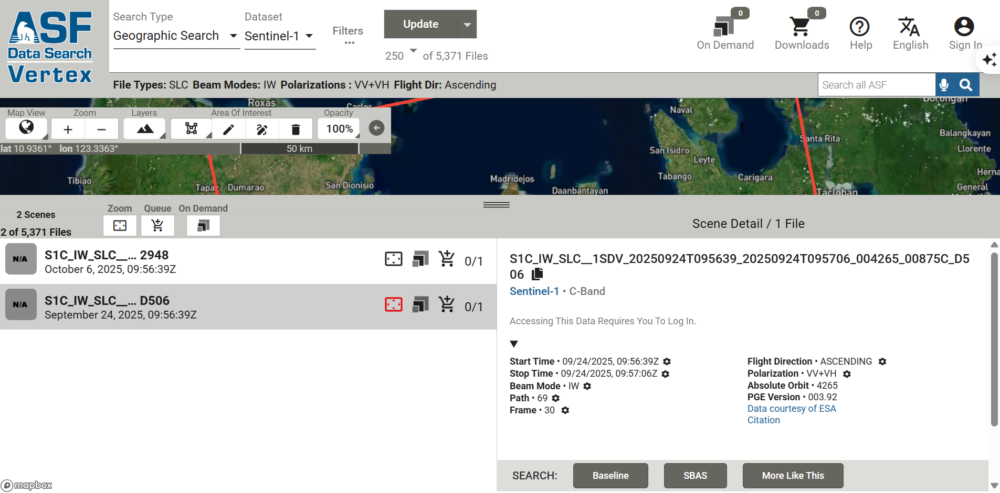

# How to download SLC images？

## Where to download？
Option 1 — Alaska Satellite Facility (ASF) Search https://search.asf.alaska.edu/
Option 2 - Copernicus Data Space https://dataspace.copernicus.eu/

### Option 1 - ASF Vertex
- Click 'Filter' on the top menu.
  - Platform: Sentinel-1A or Sentinel-1C

- Filling the filter with below：
  - For AOI: can generate a GeoJson file in notepad, and then import to the filter. See `guides/cebu_aoi.geojson`. 
   - Basically, it is taking ~50km X 50km around the epicenter 11.15° N, 124.14° E which are below: 
     - Lat: 11.0° N to 11.5° N
     - Lon: 123.9° E to 124.4° E
  - Date Range: 2025-09-24 to 2025-10-6 (Ascennding)
  - File Type: L1 SLC
  - Beam Mode: IW (Interferometric Wide)
  - Polarization: VV+VH
  - Direction：Ascending

  

### Option 2 - Copernicus
