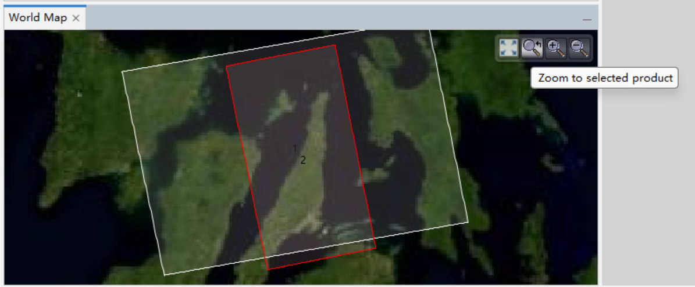
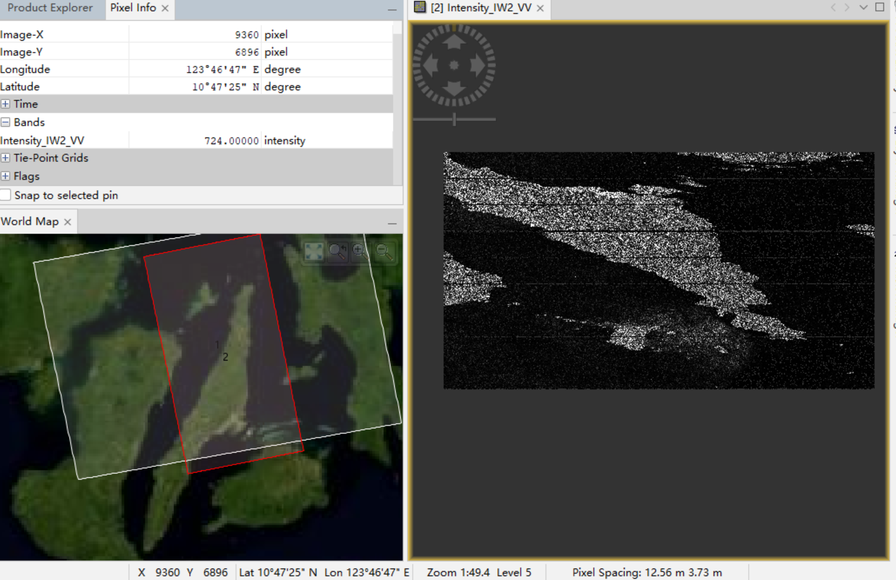

## 1. Open file 
Now you have downloaded zip file ready. Unzip them, and open the `manifest.safe` in SNAP.

## 2. TOPS split for Sentinel-1 
- `Radar → Sentinel-1 TOPS → S-1 TOPS Split`
- outuput: `*_split.dim`

## 3. Apply precise orbit file
- `Radar → Apply Orbit File`
- output: `*_split_Orb.dim`

## 4. Subset (Biggest size reduction)
- `Raster → Subset`
- In my case, the scene end X: 24477， scene end Y: 13490 which tells the size of the image (Width ~= 24,478 pixels, Height ~= 13,491 pixels）that is too big and will take really long to further processing later on. 

### Subset by geographic location
- Find the target location on the map, in my case - Cebu
    - `View → Tool Windows → World Map`
     - `View → Tool Windows → World View` to find lat and lon information 
    - zoom into the target region

    
   
- Open the SAR image, on the left pane, under `Bands - Intensity_IW2_VV`, should see Grayscale SAR image.

    

#### Two ways of finding subset geo location and corresponding pixel x and y values
- **Option 1** (easier without manual search): 
    - Based on Epicenter (find from googld), calculate the norht, south, west, east bound (50 km in latitude ≈ 0.45° (1° latitude ≈ 111 km) and 50 km in longitude ≈ 0.45° × cos(latitude)) : 
        - North  = 11.359
        - South  = 10.909
        - West   = 123.915
        - East   = 124.373

        

- **Option 2** (manual way):  Mouse over the world view to see the lat and lon you want it to be the epic center, record the lat and lon. Then mouse over the SAR image, find the pixel X and Y when the lat and lon matched with the ones you recorded. Record the pixel X and Y.
    - `View → Tool Windows → Pixel Info`
    - Cebu：`Lat ~ 10.3157° N  Lon ~ 123.8854° E`
    - Epicenter (Visayas): `Lat ~ 11.134° N  Lon ~ 124.144° E`
    - My values : `Lat ~ 11.1313° N  Lon ~ 124.0017° E  Pixel X 18504 Y 10232`
    - Subset width/height: ~ 3000/5000 x 3000/5000 

    

- Output: `subset_*_split.Orb.dim` (by export as **BEAM-DIMAP**)

    

### Check the subset size 
    - Right click on the intensity under the band -> properties
    - `7791 x 4652` which is much smaller than the `24479 x 13491` before.
    

## 5. Multilooking (reduce resolution) - need to do after interferogram generation, cannot apply to single SLC image. 
