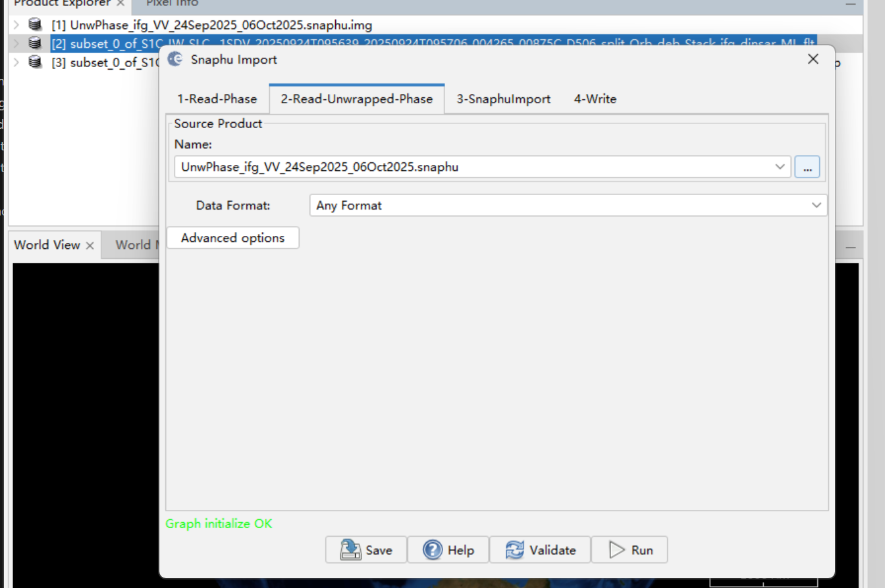

# SNAP workflow with preprocessed SLC 

## Steps (SLC → Subset → Coregistration → Interferogram → TPR  → Multilooking  → GP Filtering → Unwrapping Process (snaphu) →  Displacement → Geocoding) 

### 1. Previous step: `tutorials\preprocess-sar.md`
    - output files: `subset_0_*_split.Orb.deb.dim` and `subset_1_*_split.Orb.deb.dim` 

### 2. **Coregistration - Back Geocoding**: Radar → Coregistration → S1 TOPS Coregistration → S-1 Back Geocoding
    - Add the two subset files
    - If Back Geocoding did not read the subset file, you can go back to the Step 1, export or save the product as **BEAM-DIMAP** if you haven't done so. 
    - output file:  `subset_*_split_Orb_deb_Stack.dim` (may have different naming, but should ends with the same)

    

    

### 3.  **Interferogram formation**: Radar → Interferometric → Products → Interferogram Formation
    - output file:  `*split_Orb_deb_Stack_Ifg.dim`

### 4. **Topographic phase removel**: Radar → Interferometric → Products → Topographic Phase Removal
    - This isolates surface deformation + atmosphere + noise. 
    - If you got error saying need deburst file, unfortunetly need to go back to `tutorials\preprocess-sar.md`, starting from Step 4 to do the deburst first.
    - output file:  `*split_Orb_deb_Stack_Ifg_dinsar.dim`

### 5. **Multilooking**: Radar → SAR Utilities → Multilooking
    - To further reduce resolution if image size is still large.
    - output file:  `*split_Orb_deb_Stack_Ifg_dinsar_ML.dim`

    

### 6. **Goldstein Phase Filtering**: Radar → Interferometric → Filtering → Goldstein Phase Filtering
    - output file:  `*split_Orb_deb_Stack_Ifg_dinsar_ML_flt.dim`

### 7. **SNAPHU Export**: Radar → Interferometric → Unwrapping → Snaphu Export
    - output folder contains below:
        

### 8. **SNAPHU Unwarp**
    - if you haven't install snaphu, go to [Phase Unwarpping with SNAPHU](https://step.esa.int/main/third-party-plugins-2/snaphu/) to download it. 
    - After you completed installation/download, go to your folder path where you export to in Step 7.
    - open `snaphu.conf`, you can find the cmd usually in line 7 under 'command to call snaphu'.
    - `type phase.hdr` to double check the samples value, should match with command
        

        **Note**: 

        | ENVI field       | snaphu.conf   |
        | ---------------- | ------------- |
        | `samples`        | COLS          |
        | `lines`          | ROWS          |
        | `data type = 4`  | FLOAT         |
        | `byte order = 0` | LITTLE_ENDIAN |
        | `byte order = 1` | BIG_ENDIAN    |

    - run ` snaphu -f snaphu.conf Phase_ifg_VV_24Sep2025_06Oct2025.snaphu.img 1954`.   
    - if got error `Unexpected or abnormal exit of child process 23068
Abort `:
        - Go back to snaphu.conf, under Input Files command out the `CORRFILE .snaphu.img`.

    - run cmd below in powershell: `snaphu.exe -f snaphu.conf Phase_ifg_VV_24Sep2025_06Oct2025.snaphu.img 1954`. If success, should see below:
        

### 9. **SNAPHU Import**: Radar → Interferometric → Unwrapping → Snaphu Import
    - Select your previous `*split_Orb_deb_Stack_Ifg_dinsar_ML_flt.dim` before Step 7 Snaphu Export as `1-Read-Phase`.
    - Select your `unwrap.hdr` exported in Step 7 as `2-Read-Unwrapped-Phase`.
    - Edit the file name in `4-Write` as target output.
    - Output: `*split_Orb_deb_Stack_Ifg_dinsar_ML_flt_imp.dim`
    - Check: in the output file, open Bands, check if it contains `unw_phase*`.

    

    

### 10. **Mask Low Coherence**: Raster → Band Maths
    - Expression should be like: `unw_phase * (coh > 0.3)`, edit the name correspondingly (see image below)
    
    
 

### 11. **Phase to Displacement**: Radar → Interferometric → Products → Phase to Displacement
    - it converts phase in radians to meters
    - Wavelength: 0.056 m (Sentinel-1 C-band)
    - Formula: d=(4/πλ)​⋅ϕ
    - Output: `*split_Orb_deb_Stack_Ifg_dinsar_ML_flt_imp_dsp.dim`

### 12. **Terrain Correction / Geocoding**: Radar → Geometric → Terrain Correction → Range-Doppler Terrain Correction
    - Digital Elevation Model: SRTM 1Sec HGT
    - Pixel spacing: 20–30 m
    - Map projection: WGS84 / UTM (Cebu → UTM Zone 51N)
    - Output: `*split_Orb_deb_Stack_Ifg_dinsar_ML_flt_imp_dsp_TC.dim`

    

### 13. Export 
    - Export the final file as GeoTiff format ! Nice job! 

*YEAH! Finally we're here! Let's move to QGIS!* 